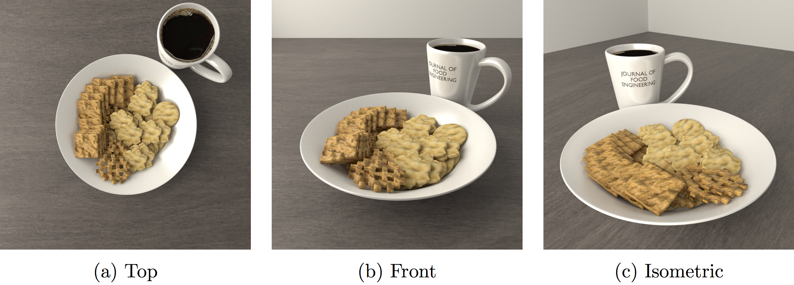
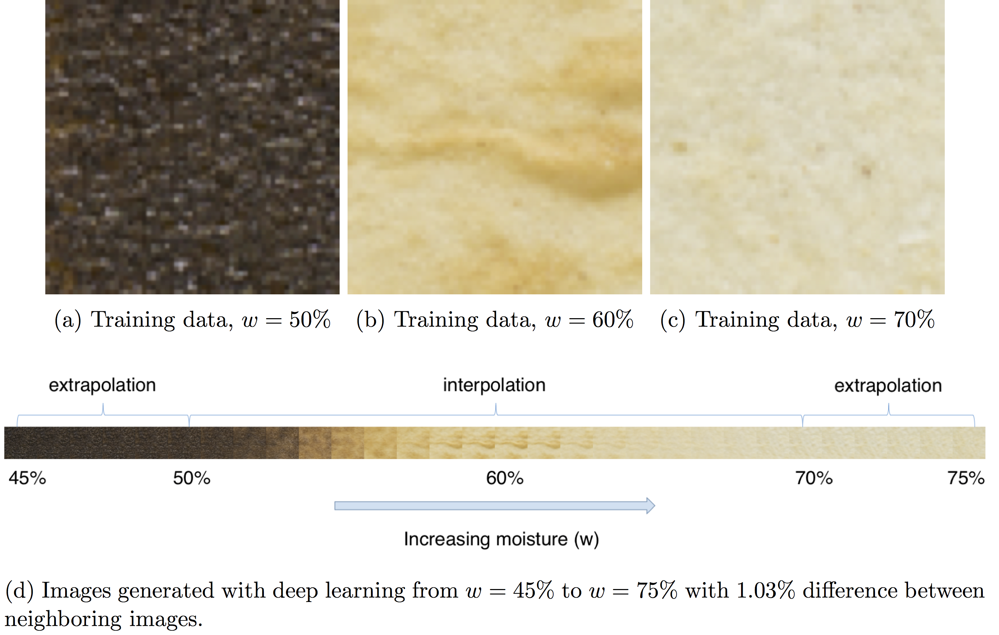

# libDeepBaking
This is a [Keras](https://keras.io) implentation of the genearitve deep learning baking paper:

Visual modeling of laser-induced dough browning. Journal of Food Engineering, 243, 9-21.
https://doi.org/10.1016/j.jfoodeng.2018.08.022

Peter Yichen Chen, Jonathan David Blutinger, Yorán Meijers, Changxi Zheng, Eitan Grinspun, and Hod Lipson




## Train
```bash
python src/learning.py -l 0
```
Where: -l allows user to continue training from a trained model. Default to be NOT activated (0).

## Test
### Tiling result (Figure 8 in the paper)
```bash
python src/predicting_all.py
```

### Interpolation result (Figure 9 in the paper)
```bash
python src/predicting_inter.py
```

## Dataset
Training data obtained from augmenting the physical experimental data (Figure 6 in the paper) is included in the "data" folder.

## Model
A pre-trained model is included in this repository: "keras_model.dms" along with its training info ("loss.npy", "val_loss.npy").

## Citation
```
@article{chen2019visual,
  title={Visual modeling of laser-induced dough browning},
  author={Chen, Peter Yichen and Blutinger, Jonathan David and Meijers, Yor{\'a}n and Zheng, Changxi and Grinspun, Eitan and Lipson, Hod},
  journal={Journal of Food Engineering},
  volume={243},
  pages={9--21},
  year={2019},
  publisher={Elsevier}
}
```
